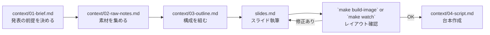

# AI向けガイド

発表資料（Marp）の管理リポジトリ。

## 構成

| パス | 役割 |
|------|------|
| `talks/_template/` | 新規発表のテンプレート、`cp -r` で使う。 |
| `talks/<YYYY-MM-DD-{name}>/` | 発表単位。`slides.md`, `talk-theme.css`, `context/`, `assets/`, `dist/`を含む |
| `docs/` | 共通知見メモ・執筆ガイド |
| `scripts/marp-talk.sh` | Marp CLI ラッパー |
| `Makefile` | 日常操作の入口（build系 / dev / watch） |

## スライド作成フロー

## ルール

- 生成物（dist/）は直接編集せずソースを修正して再生成
- 画像・メモ・テーマは発表ディレクトリに寄せ、共通化は明確な場合のみ`docs/`へ
- レイアウト確認は `make build-image` 後に `dist/images/*.png` を見る
