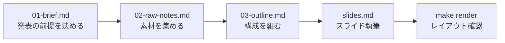

# AI向けガイド

発表資料（Marp）の管理リポジトリ。

## 構成

| パス | 役割 |
|------|------|
| `talks/_template/` | 新規発表のテンプレート（`cp -r` で使う） |
| `talks/<YYYY-MM-DD-name>/` | 発表単位（slides.md / context/ / assets/ / dist/） |
| `docs/` | 共通知見メモ・執筆ガイド |
| `shared/theme.css` | 共通テーマ |
| `scripts/marp-talk.sh` | Marp CLI ラッパー |
| `Makefile` | 日常操作の入口（render / preview / watch / clean） |

## スライド作成フロー

## ルール

- 発表ディレクトリ名は `YYYY-MM-DD-{name}` 形式
- 生成物（dist/）は直接編集せずソースを修正して再生成
- 画像・メモは発表ディレクトリに寄せ、共通化は明確な場合のみ docs/ / shared/ へ
- レイアウト確認は `make render` 後に `dist/images/*.png` を見る
