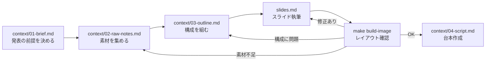

Marpスライドの執筆用レポジトリ。
スキルやサブエージェントを使用してユーザーの発表準備を支援を行う。

## 主要ファイル

| パス | 役割 |
|------|------|
| `talks/_template/` | 新規発表のテンプレート |
| `talks/<YYYY-MM-DD-{name}>/` | 発表単位。`slides.md`, `talk-theme.css`, `context/`, `assets/`, `dist/` を含む |
| `docs/rule-*.md` | コンテキストファイル・スライドの記述ルール |
| `Makefile` | 開発用のコマンド定義 |

## スライド作成フロー

各ステップは前後することがある。素材不足・構成の見直しが生じた場合は1つ前のステップに戻る。

## 主要コマンド

| コマンド | 内容 |
|---------|------|
| `make build-image` | PNG を生成して `dist/images/` に出力 |
| `make build-pdf` | PDF を生成して `dist/` に出力 |
| `make dev` | ブラウザプレビューを起動 |
| `make watch` | ファイル変更を監視してリビルド |
