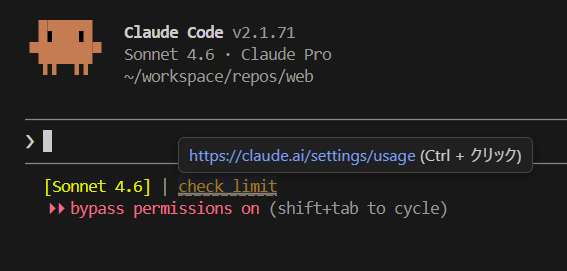
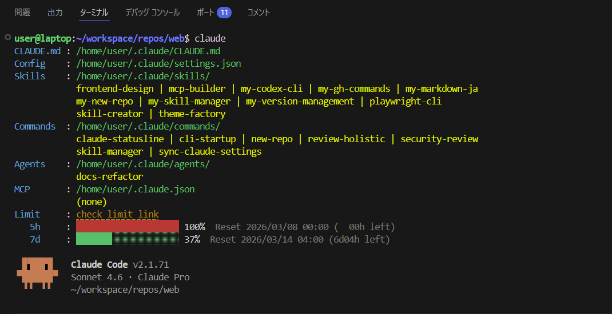

<!-- _class: title -->

# AIをいい感じに使う 設定や環境のアレコレ

## 派手な活用より、毎日の面倒を減らした話

03/12 LT

---

# 自己紹介

らてです。

個人開発とWebまわりを触っています。

作ったものは`ratete.dev`で公開しています。

今日は、AIを盛る話より、開発を続けやすくした運用の話をします。

---

# このスライドについて

新機能の紹介ではありません。

毎回ちょっと引っかかる面倒を、どう減らしたかの共有です。

設定 / 環境 / 確認フロー / 役割分担。

小さい改善を積み上げて、続けやすさを上げた話です。

---

<!-- _class: chapter -->

# 摩擦を減らすためにやったこと

---

<!-- _class: key-message -->

# 結論

毎回ちょっと引っかかる面倒を減らす。

それだけで、個人開発はかなり続けやすくなります。

待ち時間 / 判断コスト / 確認の往復。
今回はこの3つを減らした話です。

---

# 実行環境を分けた

普段使いはWindowsです。

開発作業はLinuxへ寄せました。

リモート構成も試しましたが、入力遅延が積み重なるほうがつらかったです。

理想形より、毎日すぐ触れることを優先しました。

---

<!-- _class: visual-right-narrow -->

# ステータスを見える化した

使用中モデルとトークン使用率を、すぐ見える位置に出しています。

続けるか、区切るか、別セッションにするか。

判断の切れ目を早く作れるようになりました。

---

# 見た目確認の往復を減らした

`playwright-cli`で変更箇所のスクリーンショット取得を自動化しました。

AIにも画像確認を手伝わせます。

ただし、小さい崩れは最後に自分の目で見ます。

完全自動化より、確認までの距離を短くしたのが効きました。

---

# 情報取得の入口も短くした

気になったXの投稿を、そのままLLMへ渡せるようにしました。

スクリーンショットやコピペを挟まないので、調べ始めるまでが短くなります。

新しい話題を追うときの負担を減らせました。

---

<!-- _class: visual-right-wide -->

# ツールは役割で使い分けた

文章や整理はClaude Code。

実装の詰めや原因分析はCodex。

一つに寄せるより、役割を分けたほうが運用しやすかったです。

---

<!-- _class: recap -->

# まとめ

- 待ち時間を減らす
- 判断コストを減らす
- 確認の往復を減らす

派手な一発より、細かい改善の積み重ねでした。

でも、その積み重ねで個人開発はかなり続けやすくなりました。

---

# 参照ソース

- [Anthropic Claude Code Overview](https://docs.anthropic.com/en/docs/claude-code/overview)
- [Playwright Screenshots](https://playwright.dev/docs/screenshots)
- [OpenAI Codex README](https://github.com/openai/codex)
- [Model Context Protocol Introduction](https://modelcontextprotocol.io/introduction)

---

# フォローアップ

- Claude CodeやCodexの機能は今後も変わります。
- 料金や制限は時期で変わる可能性があります。
- 最新の設定や資料は公開URLから追えるようにします。

---

# Q&A例

- まず何から整えるのがおすすめですか。
- ステータスラインには何を出すと効きますか。
- Claude CodeとCodexは、どう切り分けると迷いにくいですか。

---

<!-- _class: closing-qr -->

# Thank you!

## AIをいい感じに使う 設定や環境のアレコレ

  

  
資料はこちらです。

  
<a href="https://ratete.dev/works/ai-dev-setup">https://ratete.dev/works/ai-dev-setup</a>

