<!-- _class: title -->

# AIをいい感じに使う 設定や環境のアレコレ

### ～開発の摩擦を減らす5つの工夫～

個人開発集会 | 2026/03/12(木)

---

## 自己紹介

らてです。WebとLLMが好きでその辺をよく触っています。

今回は、特定の技術やプロダクトにフォーカスした話ではなく、

開発をしやすくするための工夫やツール設計の話をします。

---

<!-- header: 1. 起動前ダッシュボードの設定 -->
<!-- _class: chapter-title -->

## 1. 起動前ダッシュボードの設定

毎回WEBダッシュボードを開く手間を0に

---

### 使用料確認の為にブラウザを開くのが面倒

- いちいちWEBダッシュボードを開くのは時間がかかる

 

### 急にリミットが来て作業が止まる

- 使用率が見えないと作業中にリミットにかかって手が止まる

---

<!-- _class: image-only -->

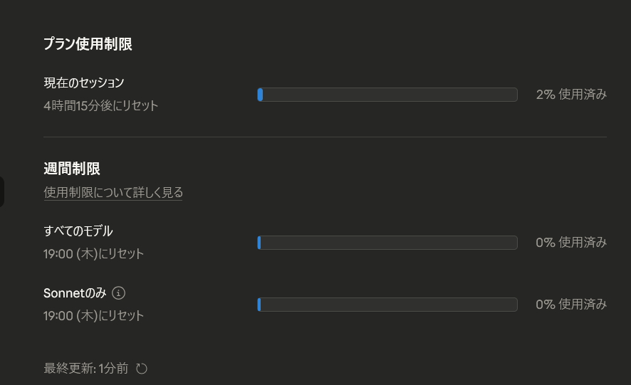

---

## 起動前ダッシュボードの設定

`agents-startup`スクリプトを作成し、`codex` / `claude`コマンド実行時に

**Claude**はOAuth API、**Codex**はapp-server経由で

使用率を取得し、プログレスバーで表示

---

<!-- _class: image-only -->

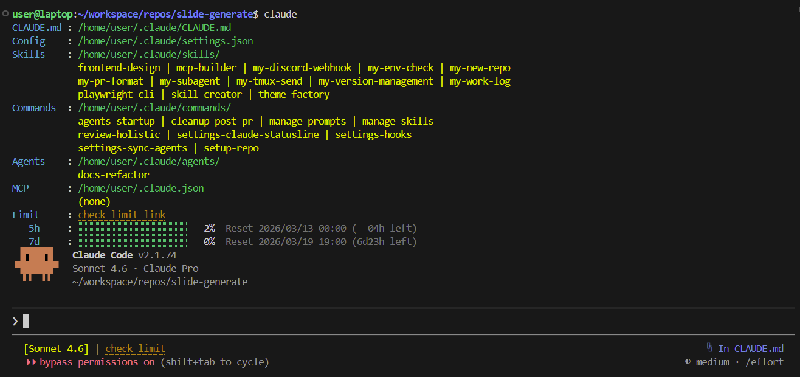

---

## 工夫点

- 起動時に動的に使用率を取得するためリアルタイムな値が確認可能
- 設定値も表示することで編集を行いやすく

---

<!-- header: 2. ステータスラインの設定 -->
<!-- _class: chapter-title -->

## 2. ステータスラインの設定

画面の端でリアルタイム表示、常に残量を意識

---

## Auto compactが発動して 文脈が突然消える

コンテキスト残量が見えず、作業が急に中断されることがあった

---

## ステータスラインの設定

ステータスライン設定を用いてセッション中のコンテキスト使用率を

画面下部にリアルタイム表示

---

<!-- _class: image-only -->

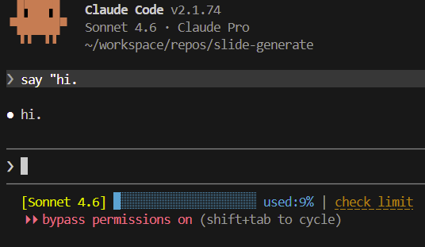

---

## 工夫点

- 使用率に応じてブロックが埋まっていく演出
- 使用率に応じて水色→緑→黄→赤に変色し、視覚的に残量を伝える

---

<!-- header: 3. 設定同期の自動化 -->
<!-- _class: chapter-title -->

## 3. 設定同期の自動化

スキル・コマンド・設定を自動で揃える

---

## ClaudeとCodexで設定がズレる

- 毎回どちらを使うか判断する認知負荷が発生
- 手動同期の手間とストレス

---

## 設定同期の自動化

- `rsync`と`cron`を用いて、`~/.claude`の設定を30分ごとに監視
- 変更があった場合、`~/.codex`へ自動同期
- gitで変更の記録も行い、GitHubリポジトリにpush

---

<!-- _class: image-only -->

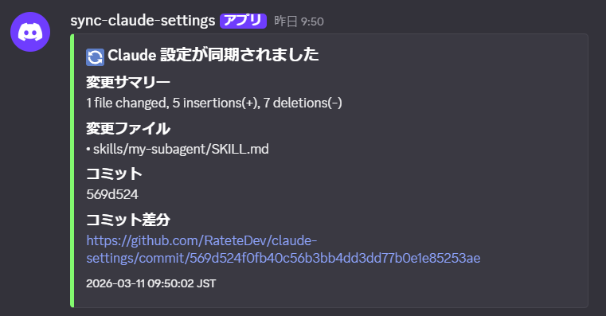

---

<!-- _class: image-only -->

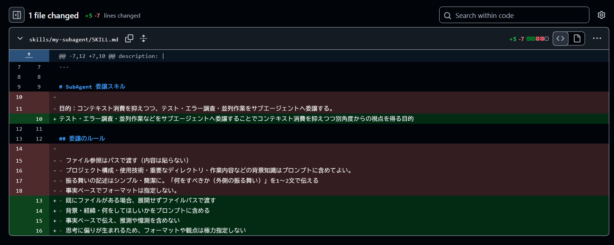

---

<!-- header: 4. Discord通知の設定 -->
<!-- _class: chapter-title -->

## 4. Discord通知の設定

AIの応答完了がEmbed通知で届く

---

## スマホで通知が受け取れず PCに戻るまで進捗が分からない

複数セッションを同時に回すと、他ウィンドウの完了にも気づけなかった

---

## Discord通知の設定

ClaudeCode / Codexのhooksを用いて、

応答完了時にDiscord WebhookへEmbed通知を自動送信

---

<!-- _class: image-only -->

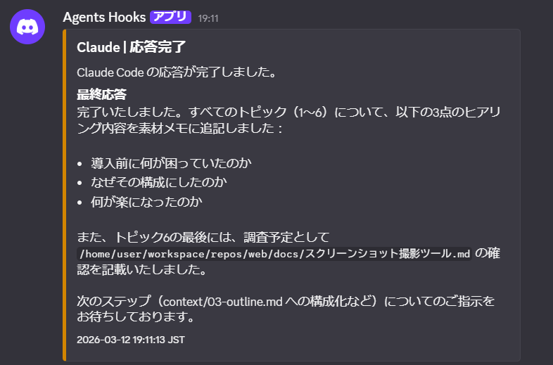

---

<!-- header: 5. PRフォーマットスキルの導入 -->
<!-- _class: chapter-title -->

## 5. PRフォーマットスキルの導入

毎回のランダムなフォーマットを統一スキルで固定

---

## PR本文が毎回ランダムで読みづらい

- Codex特有の表現やネストした箇条書きが認知コストを上げていた
- PRごとにフォーマットが異なり、内容の把握に時間がかかる

---

<!-- _class: image-only -->

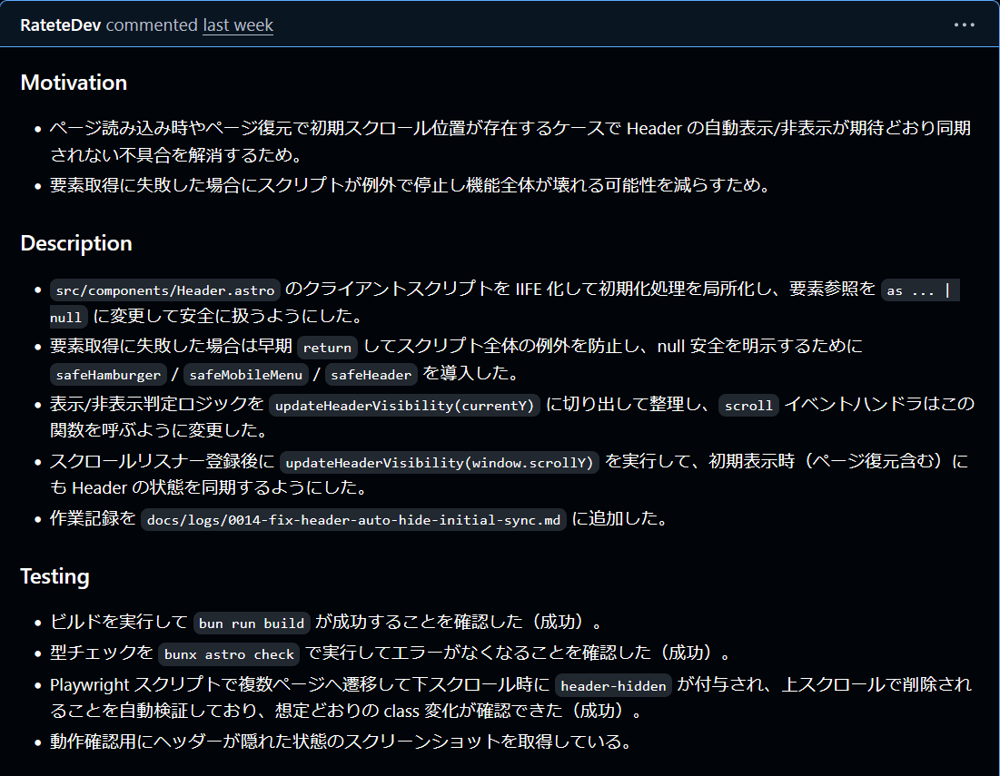

---

<!-- _class: image-only -->

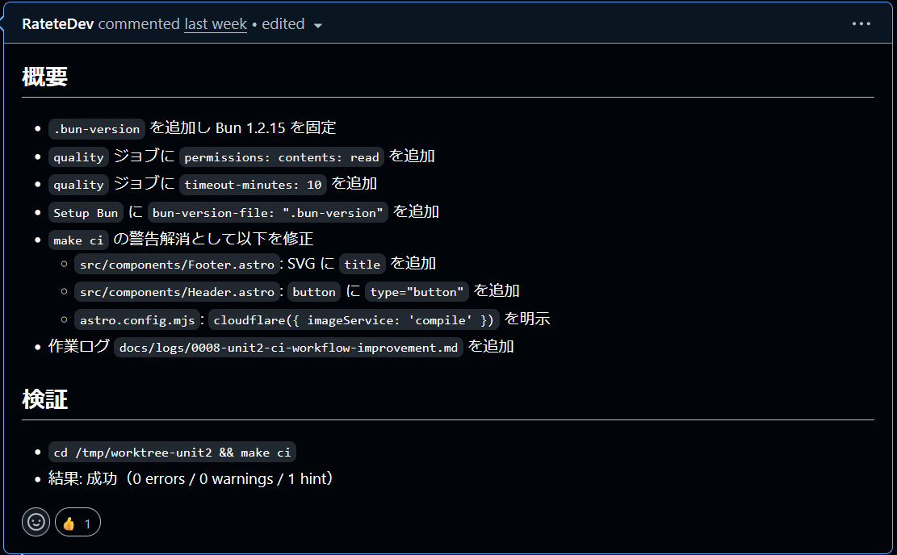

---

## PRフォーマットスキルの導入

`my-pr-format`スキルを用いて、PR作成時に

4つの見出し + テーブル形式の変更履歴 + まとめ + 備考・懸念のフォーマットを適用させた

---

<!-- _class: image-only -->

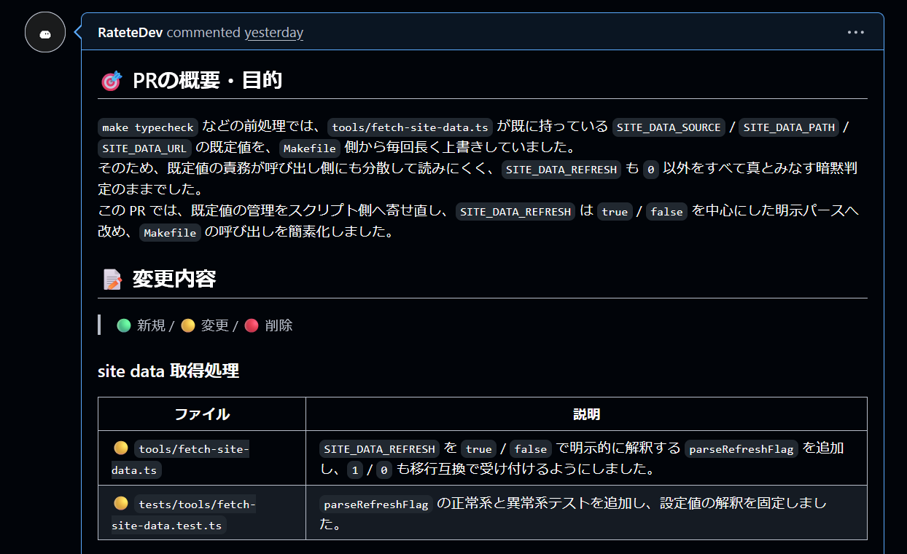

---

<!-- _class: image-only -->

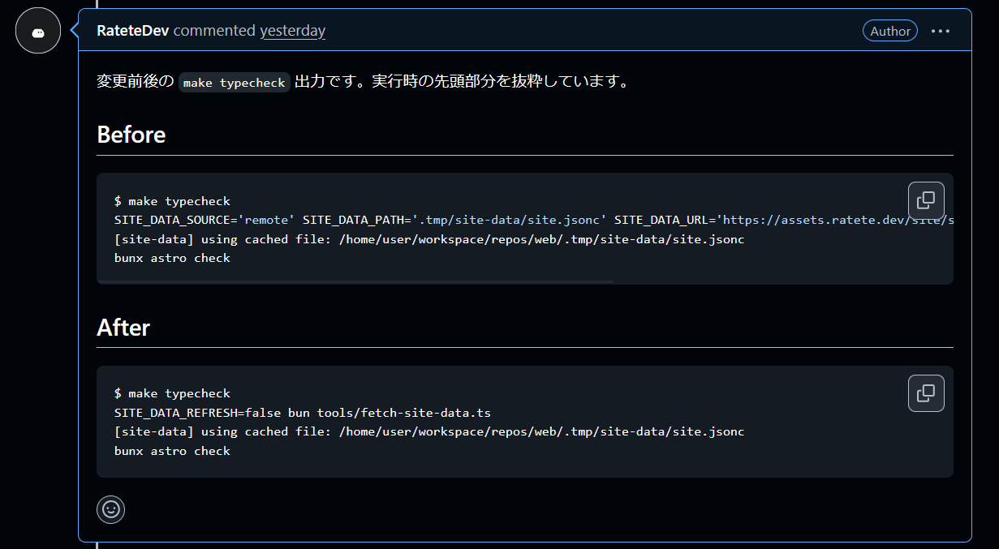

---

<!-- _class: image-only -->

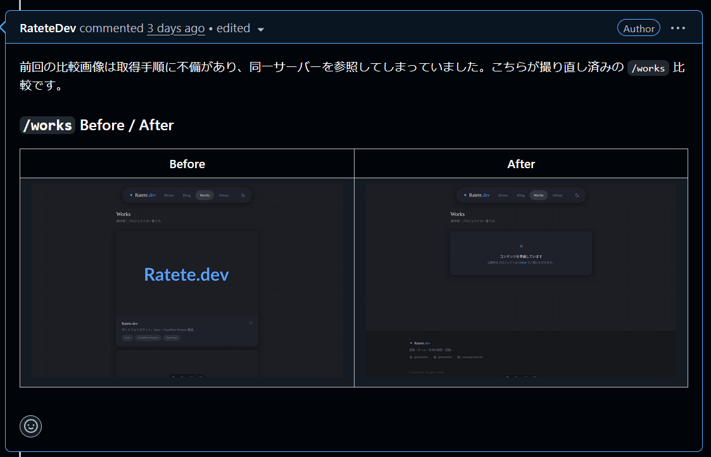

---

## Q&A

ご質問お待ちしています
